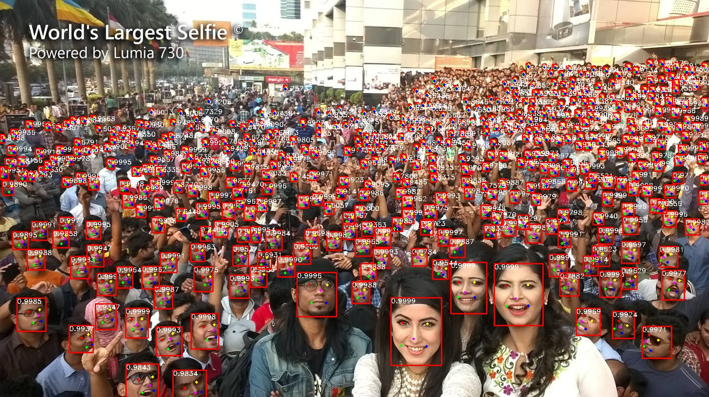

# Face-Detector-1MB-with-landmark
## 实现功能
 - Retinaface-mobile0.25的训练/测试/评估/ncnn C++推理
 - Face-Detector-1MB slim和RFB版本的训练/测试/评估/ncnn C++推理
 - 人脸5个关键点检测
 - 支持onnx导出
# 带有关键点检测的超轻量级人脸检测器

提供了一系列适合移动端部署包含关键的人脸检测器: 对[Retinaface-mobile0.25](https://github.com/biubug6/Pytorch_Retinaface)修改anchor尺寸,使其更适合边缘计算; 重新实现了[Face-Detector-1MB](https://github.com/Linzaer/Ultra-Light-Fast-Generic-Face-Detector-1MB) 并添加了关键点检测和ncnn C++部署功能, 在绝大部分情况下精度均好于原始版本.
<p align="center"></p>
## 测试过正常的运行环境
- Ubuntu18.04
- Python3.7
- Pytorch1.2
- CUDA10.0 + CUDNN7.5

## 精度
### Widerface测试
 - 在WIDER FACE test集测试精度（单尺度输入分辨率：**320*240**）
模型|Easy Set|Medium Set|Hard Set
------|--------|----------|--------
libfacedetection v1（caffe）|0.65 |0.5       |0.233
libfacedetection v2（caffe）|0.714 |0.585       |0.306
version-slim(原版)|0.765     |0.662       |0.385
version-RFB(原版)|0.784     |0.688       |**0.418**
version-slim(our)|0.795     |0.683       |0.34.5
version-RFB(our)|**0.814**     |**0.710**       |0.363
Retinaface-Mobilenet-0.25(our)  |0.811|0.697|0.376

- 在WIDER FACE test集测试精度（单尺度输入分辨率：**640*480**） 

模型|Easy Set|Medium Set|Hard Set
------|--------|----------|--------
libfacedetection v1（caffe）|0.741 |0.683       |0.421
libfacedetection v2（caffe）|0.773 |0.718       |0.485
version-slim(原版)|0.757     |0.721       |0.511
version-RFB(原版)|0.851     |0.81       |0.541
version-slim(our)|0.850     |0.808       |0.595
version-RFB(our)|0.865    |0.828       |0.622
Retinaface-Mobilenet-0.25(our)  |**0.873**|**0.836**|**0.638**

ps: 测试的时候,长边为320 或者 640 ,图像等比例缩放.

### Contents
- [Installation](#installation)
- [Training](#training)
- [Evaluation](#evaluation)
- [C++ inference(ncnn)](#C++ inference(ncnn))
- [References](#references)

## Installation
##### Clone and install
1. git clone https://github.com/biubug6/Face-Detector-1MB-with-landmark.git

2. Pytorch version 1.1.0+ and torchvision 0.3.0+ are needed.

3. Codes are based on Python 3

##### Data
1. The dataset directory as follows:

```Shell
  ./data/widerface/
    train/
      images/
      label.txt
    val/
      images/
      wider_val.txt
```
ps: wider_val.txt only include val file names but not label information.

2. We provide the organized dataset we used as in the above directory structure.

Link: from [google cloud](https://drive.google.com/open?id=11UGV3nbVv1x9IC--_tK3Uxf7hA6rlbsS) or [baidu cloud](https://pan.baidu.com/s/1jIp9t30oYivrAvrgUgIoLQ) Password: ruck

## Training

1. Before training, you can check network configuration (e.g. batch_size, min_sizes and steps etc..) in ``data/config.py and train.py``.

2. Train the model using WIDER FACE:
  ```Shell
  CUDA_VISIBLE_DEVICES=0 python train.py --network mobile0.25 or 
  CUDA_VISIBLE_DEVICES=0 python train.py --network slim or
  CUDA_VISIBLE_DEVICES=0 python train.py --network RFB
  ```

If you don't want to train, we also provide a trained model on ./weights
  ```Shell
  mobilenet0.25_Final.pth 
  RBF_Final.pth
  slim_Final.pth
  ```
## Evaluation
### Evaluation widerface val
1. Generate txt file
```Shell
python test_widerface.py --trained_model weight_file --network mobile0.25 or slim or RFB
```
2. Evaluate txt results. Demo come from [Here](https://github.com/wondervictor/WiderFace-Evaluation)
```Shell
cd ./widerface_evaluate
python setup.py build_ext --inplace
python evaluation.py
```
3. You can also use widerface official Matlab evaluate demo in [Here](http://mmlab.ie.cuhk.edu.hk/projects/WIDERFace/WiderFace_Results.html)

## C++ inference(ncnn)
1. Generate onnx file
```Shell
python convert_to_onnx.py --trained_model weight_file --network mobile0.25 or slim or RFB
```
2. Onnx file change to ncnn(*.param and *.param)
```Shell
cp *.onnx ./Face_Detector_ncnn/tools
cd ./Face_Detector_ncnn/tools
./onnx2ncnn face.param face.bin
```
3. Move *.param and *.bin to model
```Shell
cp face.param ../model
cp face.bin ../model
```
4. Build Project(set opencv path in CmakeList.txt)
```Shell
mkdir build
cd build
cmake ..
make -j4
```
5. run
```Shell
./FaceDetector *.jpg
```

We also provide the converted file in "./model".
```Shell
face.param
face.bin
```


## References
- [FaceBoxes](https://github.com/zisianw/FaceBoxes.PyTorch)
- [Retinaface (mxnet)](https://github.com/deepinsight/insightface/tree/master/RetinaFace)
- [Retinaface (pytorch)](https://github.com/biubug6/Pytorch_Retinaface)
- [Ultra-Light-Fast-Generic-Face-Detector-1MB](https://github.com/Linzaer/Ultra-Light-Fast-Generic-Face-Detector-1MB)
```
@inproceedings{deng2019retinaface,
title={RetinaFace: Single-stage Dense Face Localisation in the Wild},
author={Deng, Jiankang and Guo, Jia and Yuxiang, Zhou and Jinke Yu and Irene Kotsia and Zafeiriou, Stefanos},
booktitle={arxiv},
year={2019}
```
